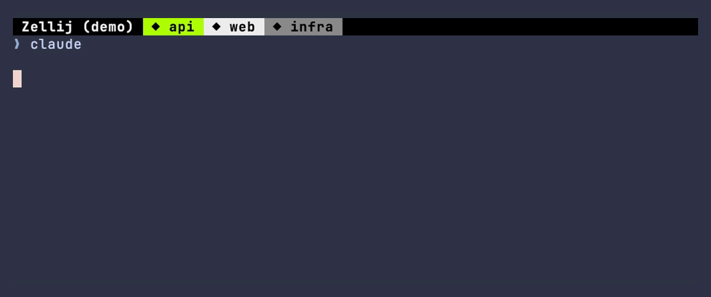

# zellij-agent-activity

A small [Zellij](https://zellij.dev) plugin that shows what your AI coding agent is doing as a
symbol in front of the tab it runs in: `⚡` running a command, `✎` editing, `⚠` waiting for you,
`✓` done. In a session with a dozen tabs, you can see which agent needs you without switching to it.

The plugin is harness-neutral. Claude Code, Codex and opencode are wired up today, and the next
harness is a producer script away.

<p align="center">
  <a href="https://github.com/vmaerten/zellij-agent-activity/actions/workflows/ci.yml"></a>
  
  
  
  
  
  
</p>

<p align="center">
  
</p>

```
◆ starting   ● thinking   ⚡ bash   ✎ edit   ◉ read   ⊜ subagent   ◈ web   ⚠ needs you   ✓ done
```

## What is it?

AI coding agents work for long stretches, then quietly block on a permission prompt, or finish,
while you're looking at another tab. This plugin puts a single symbol in the tab name that follows
the live activity of the agent session running in that pane.

Zellij lets only one plugin own a tab's name, and two fighting over it produce flickering renames.
So exactly one owns it and you pick which: this plugin, decorating whatever the tab is already
called, or [`zellij-tab-namer`](https://github.com/vmaerten/zellij-tab-namer), which takes the
symbol over its decoration pipe and composes the name itself. Either way, no new status bar, no
extra column, no rename war.

## Install

You need Zellij 0.45.0 or later (`zellij --version`), plus `jq` and bash for the Claude Code and
Codex producers. The [compatibility matrix](docs/COMPATIBILITY.md) says which Zellij versions a
given plugin version is built against.

**1.** Download the wasm from the latest release into your plugins dir:

```sh
curl -L -o ~/.config/zellij/plugins/zellij-agent-activity.wasm \
  https://github.com/vmaerten/zellij-agent-activity/releases/latest/download/zellij-agent-activity.wasm
```

**2.** Load it in `~/.config/zellij/config.kdl`. The `mode` key says who owns the tab name and is
**mandatory**: without it the plugin does nothing. Standalone, it owns the name itself:

```kdl
load_plugins {
    "file:~/.config/zellij/plugins/zellij-agent-activity.wasm" {
        mode "rename"
    }
}
```

Alongside [`zellij-tab-namer`](https://github.com/vmaerten/zellij-tab-namer), which names your tabs
after the git repo or directory, it decorates that name instead of owning it:

```kdl
load_plugins {
    "file:~/.config/zellij/plugins/zellij-tab-namer.wasm";
    "file:~/.config/zellij/plugins/zellij-agent-activity.wasm" {
        mode "pipe"
    }
}
```

The two are mutually exclusive: running `rename` next to the namer is two plugins rewriting the same
name forever. What each mode does exactly is in [`docs/MODES.md`](docs/MODES.md).

**3.** Restart Zellij and grant the permissions it asks for. Each mode requests only what it uses,
so `pipe` never holds the ability to rename a tab.

**4.** Install the producer for your agent, below.

## Harnesses

The producer is the piece that reports what your agent is doing. Each harness gets its own, shipped
from this repo as an extension of that harness.

| Harness | Minimum version | Producer |
|---|---|---|
| Claude Code | 2.1.120 | [`producers/claude`](producers/claude/README.md) |
| Codex | 0.146.0 | [`producers/codex`](producers/codex/README.md) |
| opencode | 1.18 | [`producers/opencode`](producers/opencode/README.md) |

```sh
# Claude Code
claude plugin marketplace add vmaerten/zellij-agent-activity
claude plugin install zellij-agent-activity@zellij-agent-activity

# Codex
codex plugin marketplace add vmaerten/zellij-agent-activity
codex plugin add zellij-agent-activity@zellij-agent-activity

# opencode loads any file dropped in its plugins directory
mkdir -p ~/.config/opencode/plugins
curl -fsSL -o ~/.config/opencode/plugins/zellij-agent-activity.js \
  https://raw.githubusercontent.com/vmaerten/zellij-agent-activity/main/producers/opencode/zellij-agent-activity.js
```

Start a new session, since all three read their extensions at launch, and the tab prefix starts
moving. Codex additionally asks you to approve the hooks the first time, in its interactive TUI:
plugin hooks arrive untrusted and stay inert until you accept them.

Running several agents? Install several producers. They are separate extensions in separate tools,
and each tab shows whichever agent runs in it.

Writing one for another harness is a script, never a change to the wasm. The wire contract is in
[`docs/ARCHITECTURE.md`](docs/ARCHITECTURE.md).

## What the symbols mean

| wire event | Meaning | Symbol |
|---|---|---|
| `SessionStart` | starting up | `◆` |
| `UserPromptSubmit`, `PostToolUse` | thinking | `●` |
| `PreToolUse` · `Bash` | running a command | `⚡` |
| `PreToolUse` · `Edit` / `Write` / `MultiEdit` | editing | `✎` |
| `PreToolUse` · `Read` / `Glob` / `Grep` | reading | `◉` |
| `PreToolUse` · `Agent` / `Task` | subagent | `⊜` |
| `PreToolUse` · `WebSearch` / `WebFetch` | web | `◈` |
| `PreToolUse` · other / MCP | tool | `⚙` |
| `Notification` · permission prompt | needs you | `⚠` |
| `Stop` | done | `✓` |
| `SessionEnd` | clears the prefix | |

This is the wire vocabulary, so it doubles as the list a producer translates into. Claude Code's
events map onto it one-to-one; the others translate in their producer.

`⚠` means blocked, never idle, and when a tab holds several agent panes the highest-priority state
wins (`⚠ waiting > tool > ● thinking > ◆ init > ✓ done`), so a pending permission request is never
hidden behind a background pane. The per-harness translations and the reasoning behind both rules
are in [`docs/ARCHITECTURE.md`](docs/ARCHITECTURE.md).

## Alternatives

[zellij-attention](https://github.com/KiryuuLight/zellij-attention) renames the tab itself with a
binary `⏳`/`✅`. [zj-radar](https://github.com/marktoda/zj-radar) adds a sidebar rail and also
renames tabs. [zjstatus](https://github.com/dj95/zjstatus) rebuilds the status bar. This one adds no
UI, and never renames behind your back: the owner of the name is a config key. Side by side in
[`docs/ARCHITECTURE.md`](docs/ARCHITECTURE.md#prior-art-and-alternatives).

## Docs

- [`docs/MODES.md`](docs/MODES.md), `pipe` vs `rename`, and what `rename` does to tabs you didn't decorate.
- [`docs/ARCHITECTURE.md`](docs/ARCHITECTURE.md), the flow, the wire contract, the activity rules, and an index of the ADRs.
- [`docs/TROUBLESHOOTING.md`](docs/TROUBLESHOOTING.md), nothing shows up, wrong symbol, upgrading, migrating off `zellij-attention`.
- [`docs/COMPATIBILITY.md`](docs/COMPATIBILITY.md), version matrix and the pinning policy.
- [`CONTRIBUTING.md`](CONTRIBUTING.md), build, tests, adding a harness, regenerating the demo.

## Credits

- Event mapping and hook patterns adapted from
  [`ishefi/zellaude`](https://github.com/ishefi/zellaude).
- Prior art and the operational lessons behind the `zellij pipe` back-pressure guard, from
  [`marktoda/zj-radar`](https://github.com/marktoda/zj-radar).
- Built to pair with [`vmaerten/zellij-tab-namer`](https://github.com/vmaerten/zellij-tab-namer).

## License

MIT.
